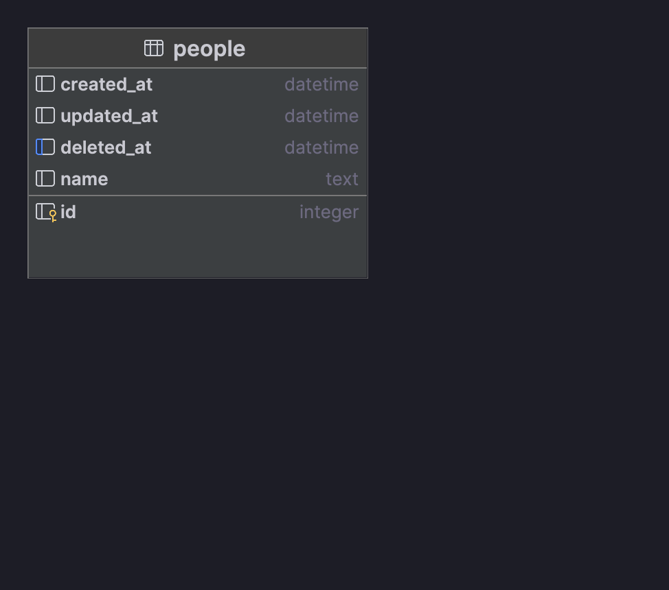

### Description
Simple REST Api that exposes CRUD endpoints to work with a `Person` resource. This project is made for the HNGx stage 2 task

### Environment Setup:
- Clone the repo: fork the repo and on your terminal, cd into a directory of choice and run `git clone https://github.com/bytedeveloperr/hngx-stage-2-task.git`
- Installing packages: Install the project's packages using `go mod download`.
- Run Locally: Once done with step two above, run `go run .`

### Base URL
- Render: https://hngx-stage-2-task.onrender.com
- Local: http://localhost:3001

### How To

#### Create new person:
- Method: POST
- Endpoint: `/api`
- Request Body: JSON e.g `{ "name": "Yusuf" }`
- Request Response: JSON e.g `{
  "status": "success",
  "data": {
  "id": 1,
  "name": "Yusuf"
  }
  }`

#### Retrieve person by ID or Name:
- Method: GET
- Endpoint: `/api/:id`, e.g `/api/1` or even with the person's name `/api/Yusuf`
- Request Body: Empty
- Request Response: JSON e.g `{
  "status": "success",
  "data": {
  "id": 1,
  "name": "Yusuf"
  }
  }`

#### Update person by ID or Name:
- Method: PUT
- Endpoint: `/api/:id`. e.g `/api/1` or even with the person's name `/api/Yusuf`
- Request Body: JSON e.g `{ "name": "Ade" }`
- Request Response: JSON e.g `{
  "status": "success",
  "data": {
  "id": 1,
  "name": "Ade"
  }
  }`

#### Delete person by ID or Name:
- Method: DELETE
- Endpoint: `/api/:id`. e.g `/api/1` or even with the person's name `/api/Yusuf`
- Request Body: Empty

### DB Diagram
